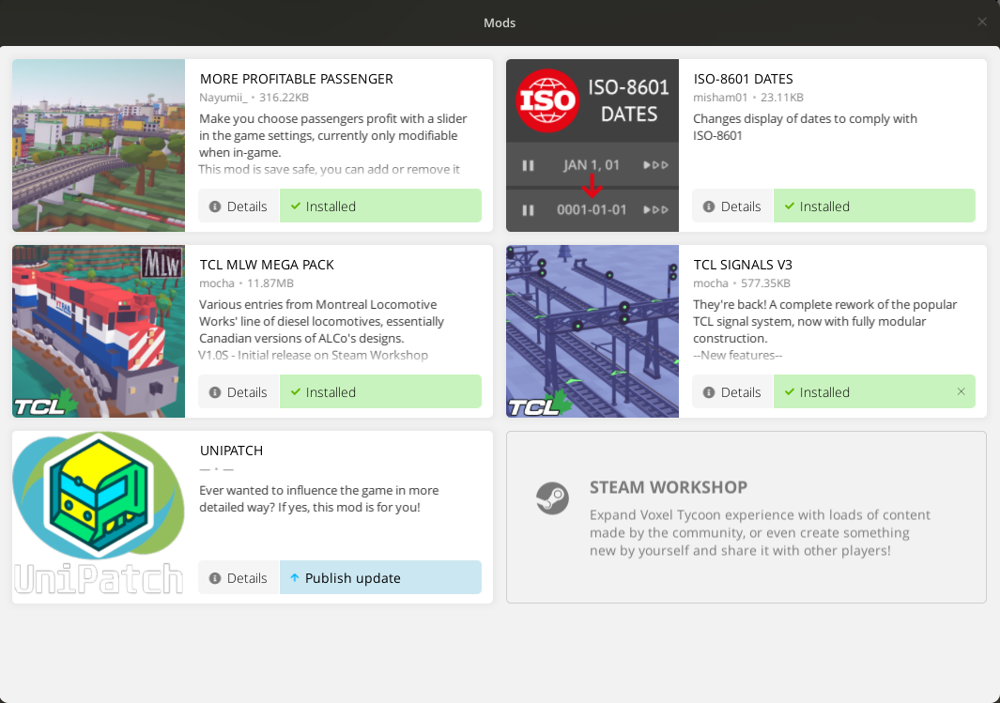
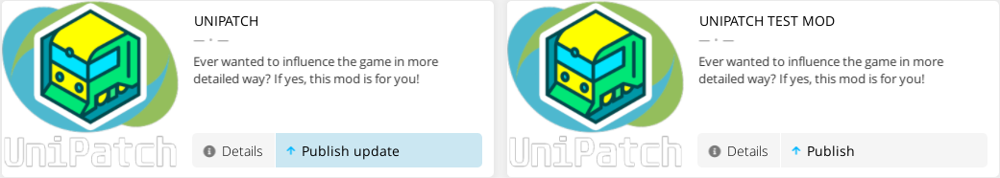

# How to publish your mod

## Introduction

This step-by-step guide is intended for mod creators who want to feature their creations on the in-game Mod Gallery. Like this:

!!! tip
    Pressing `F5` in the mod browser causes the game to reload mods and mods list.

## Prepare mod for publishing

### Add preview image

Take a screenshot of your mod in action, and save it as `preview.png`. Drop the image into your mod's root folder. It should be square and its dimensions should be at least `512x512` pixels.

### Set custom title and description

Create a new file called `mod.json`, and place it in your mod's root folder. Its contents should be set up as specified [in here](./mod.json.md).

## Publish and update

Just choose the appropriate action on your mod.

<!-- prettier-ignore -->
!!! important
    You can publish only mods that are not tracked as **installed**, i.e. was not downloaded from the gallery but manually placed to `Content/` by you.

    If you are updating a mod that is already published, users that have it installed will see that an update is available for it.

<!-- prettier-ignore -->
!!! tip
    If you somehow lost original files to your mod and think you won't be able to update it? Don't worry, see how to fix that [here](./mod.json.md#publishedfileid).

## Managing your mod

Additional images, description, visibility settings and other information can be found on your mod's page on [Steam Workshop](https://steamcommunity.com/app/732050/workshop/).

You can add images, videos and 3D models or your mod's Steam Workshop page in `Owner Controls > Add/edit images & videos`.

<!-- prettier-ignore -->
!!! hint
    It's useful to have two copies of your mod - one for development (in `Content/` folder) and one from workshop for testing.

<!-- prettier-ignore -->
!!! tip
    You can localize your mod's name, description and changelogs on the Steam Workshop page.

## Unpublishing the mod

You can unpublish the mod on the workshop page

<!-- prettier-ignore -->
!!! attention
    Unpublishing the mod means removing the mod for everyone who subscribed to it. Use with **extreme** caution!
